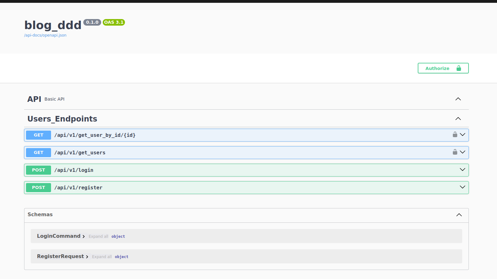
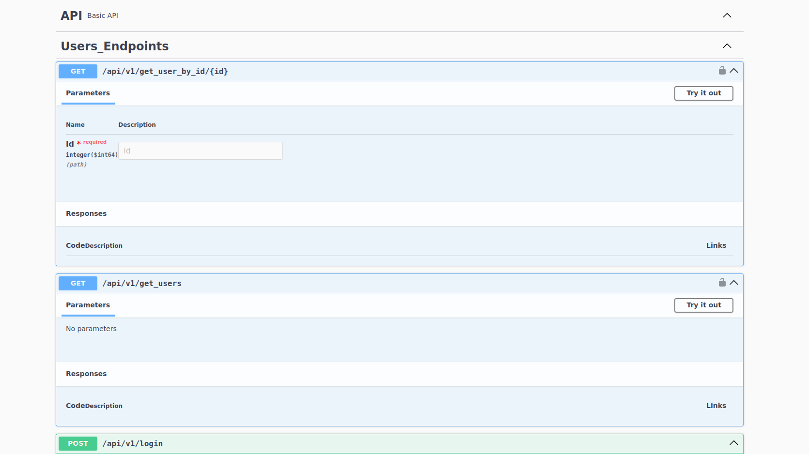
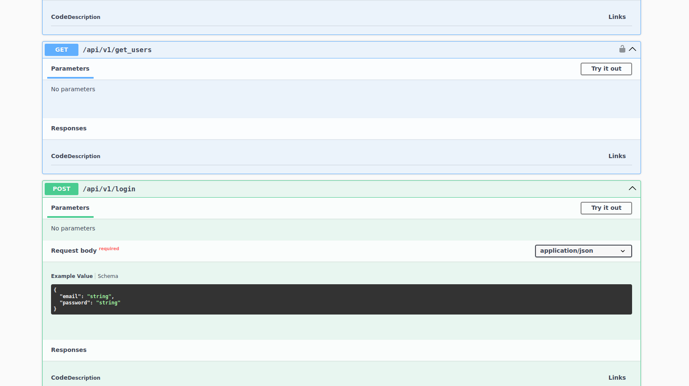
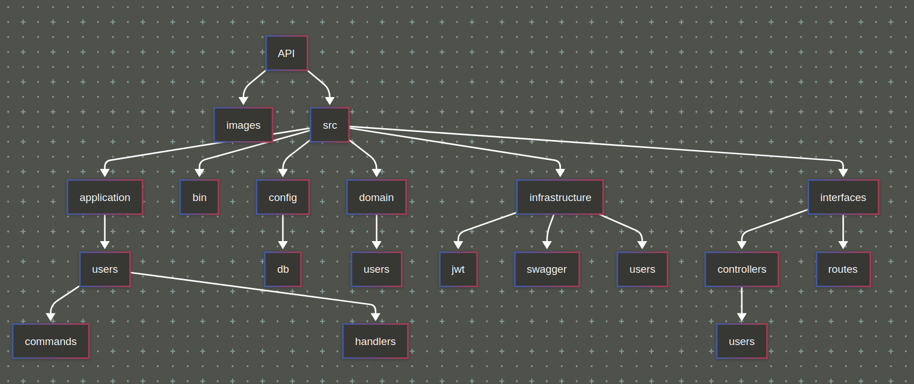

<h1 align="center">
  <br>
  Desarrollado por
  <br>
  <a href="https://github.com/ViCode321" target="_blank">ViCode321</a>
  <br>
</h1>


<h4 align="center">Login API_REST con <a href="https://actix.rs/" target="_blank">ACTIX WEB</a></h4>


<p align="center">
  <a href="#features">Features</a> •
  <a href="#empezar">Empezar</a> •
  <a href="#descarga">Descarga</a> •
  <a href="#probar-endpoints">Probar Endpoints</a> •
  <a href="#estructura">Estructura</a> •
  <a href="#dependecias">Dependecias</a>
</p>

<p align="center">
  
  
  
</p>

## Features


## Features

* Login de usuario
* Base PostgreSQL adminstrada con [SeaORM](https://www.sea-ql.org)
* End-points de Login, Registro, Obtención de usuario por Id y obtención de usuarios en general
* Swagger implementado con [Utoipa](https://github.com/juhaku/utoipa)
* Encryptación de contraseña
* Token JWT
* APIs protejidas por token

## Empezar

Primero crearemos la base de datos PostgreSQL

```bash
# Definir base master
USE master;

# Crear base de datos
CREATE DATABASE data_base;

# Definir base de datos creada
USE data_base;

# Crear tabla users
CREATE TABLE public.users (
    id bigint(64,0) NOT NULL,
    email character varying NOT NULL
    encrypted_password character varying NOT NULL,
    created_at timestamp without time zone NOT NULL,
    updated_at timestamp without time zone NOT NULL,
    primer_nombre character varying(20) NOT NULL,
    segundo_nombre character varying(20),
    primer_apellido character varying(20) NOT NULL,
    segundo_apellido character varying(20),
);
```

> **Nota**
> Si no sabes como instalar PostgreSQL en Ubuntu, [Mira esta guía](https://documentation.ubuntu.com/server/how-to/databases/install-postgresql/index.html)

Para clonar y ejecutar estas APIs necesitas instalar [Rust](https://www.rust-lang.org/es) y [cargo](https://docs.rs/cargo) en tu máquina linux. Para mas información [Mira esta guía](https://www.rust-lang.org/tools/install)


```bash
# Clonar repositorio
$ git clone https://github.com/ViCode321/LOGIN_API_REST_ACTIX_WEB.git

# Ingresar en carpteta raíz
$ cd LOGIN_API_REST_ACTIX_WEB

# Constriur Target y Cargo.lock
$ cargo build

# Ejecutar
$ cargo run
```


## Descarga

Si no deseas clonar el repositorio y prefieres descargar el proyecto en .ZIP, acá puedes hacerlo [Descargar](https://github.com/ViCode321/LOGIN_API_REST_ACTIX_WEB/archive/refs/heads/main.zip)

## Probar Endpoints

Cuando ejecutes el proyecto, el servidor se abrirá en el puerto http://127.0.0.1:8080
con esto puedes probar las APIs con la herramienta [Postman](https://www.postman.com/product/what-is-postman/#home) o acceder a la url que proporciona la integración de swagger http://localhost:8080/docs-v1/

* Registro de Usuario
```bash
http://localhost:8080/api/v1/register
```
* Json de ejemplo
```bash
{
  "email": "vicode321@gmail.com",
  "encrypted_password": "1234",
  "primer_apellido": "wayne",
  "primer_nombre": "bruce",
  "segundo_apellido": "díaz",
  "segundo_nombre": "bruno",
}
```

* Login de usuario 
```bash
# Este genera el token JWT para usar en las otras APIs
http://localhost:8080/api/v1/login
```
* Json de ejemplo
```bash
{
  "email": "vicode321@gmail.com",
  "password": "1234"
}
```
* Obtener usuario por id
```bash
http://localhost:8080/api/v1/get_user_by_id/1
```
* Obtener todos usuarios
```bash
http://localhost:8080/api/v1/get_users
```




## Estructura


## Dependecias
```bash
actix-web = "4.11.0"
async-trait = "0.1.88"
bcrypt = "0.17.0"
chrono = { version = "0.4.41", features = ["serde"]}
clap = { version = "4.5.38", features = ["derive", "env"] }
dotenv = "0.15.0"
env_logger = "0.11.8"
futures-util = "0.3.31"
jsonwebtoken = "9.3.1"
lazy_static = "1.5.0"
log = "0.4.27"
sea-orm = { version = "1.1", features = ["sqlx-postgres", "runtime-async-std-native-tls"] }
serde = { version = "1.0.219", features = ["derive"] }
serde_json = "1.0.140"
tokio = { version = "1.45.1", features = ["full"] }
utoipa = { version = "5.3.1", features = ["actix_extras", "chrono"] }
utoipa-swagger-ui = { version = "9.0.2", features = ["actix-web", "debug-embed"] }
validator = { version = "0.20.0", features = ["derive"] }
```

## Espero que te haya servido ♥


